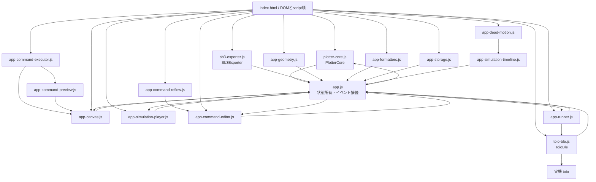
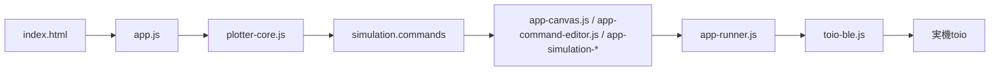
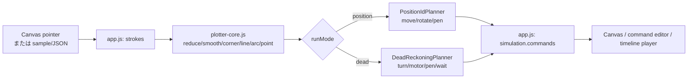
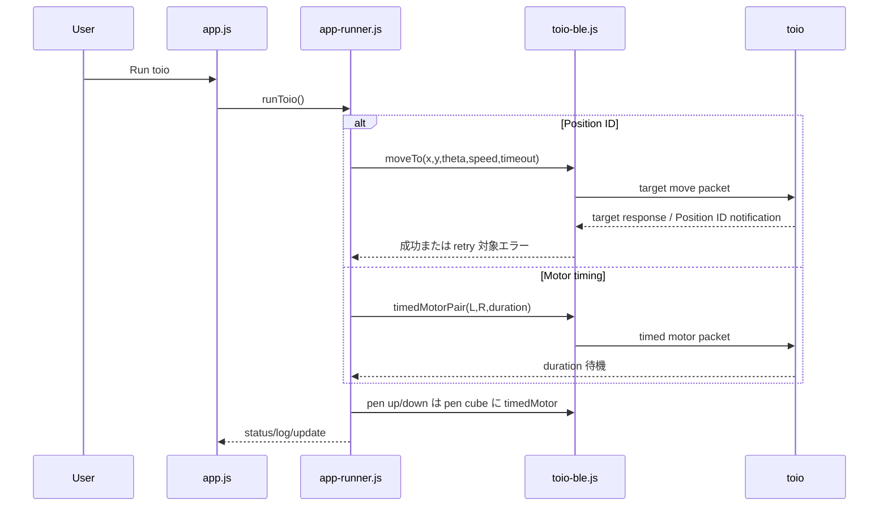

# toio G-code Generator アーキテクチャ

この文書は、現在の実装をコードから読み取って整理したものです。リファクタリング後の理想構成ではなく、ブラウザで実際にロードされるファイル、状態の所有元、処理の分岐を記載します。

## 1. システム概要

本アプリは、Canvas 上のフリーハンド線またはサンプル/JSON の描画データを、toio の移動コマンドへ変換してシミュレーションし、2 台の toio（移動用・ペン昇降用）で実行するブラウザアプリです。

実行モードは次の 2 つです。

- **Position ID**: toio の座標マット上の目標 `(x, y, theta)` を指定する。移動中の補正は toio 側の Position ID 制御に任せる。
- **Motor timing**（内部名 `dead` / Dead reckoning）: 左右モーター速度と駆動時間を指定する。実行開始時のペン先位置・toio の向きを基準に、以後の位置を推定する。

描画の座標/形状を作る処理と、実機の時間・速度を校正する処理は別責務です。特に、直線 draw の校正 `deadMmPerSecAtDrawSpeed` と円弧 draw の校正 `deadArcMmPerSecAtDrawSpeed` は独立しています。

## 2. 全体アーキテクチャ図

### ブラウザのロード順

`index.html` は ES module import ではなく、通常の script タグで次の順に読み込みます。各ファイルは `window` 上の名前空間を後続ファイルへ公開します。



実際の script 順は次のとおりです。

```text
plotter-core.js
toio-ble.js
sb3-exporter.js
app-geometry.js
app-formatters.js
app-storage.js
app-dead-motion.js
app-canvas.js
app-command-executor.js
app-command-preview.js
app-simulation-timeline.js
app-simulation-player.js
app-command-reflow.js
app-command-editor.js
app-runner.js
app.js
```

要求された処理の見取り図を command 列中心に書くと、次の流れです。



`app.js` は最後に読み込まれ、DOM 要素を取得し、各モジュールの factory に getter/callback を渡して組み立てます。`plotter-core.js` と `toio-ble.js` は CommonJS 環境でもテストできる UMD 形式です。

## 3. 主要ファイル一覧と責務

### アプリ本体

| ファイル | 役割 |
| --- | --- |
| `index.html` | 画面 DOM、設定入力、Canvas、コマンド表示、script 読み込み順を定義する。 |
| `styles.css` | 画面レイアウト、Canvas 周辺、右パネル、コマンド行、状態表示の CSS。 |
| `app.js` | アプリの composition root。設定・描画・simulation・接続中 cube・実行状態を保持し、イベントを束ねる。 |
| `plotter-core.js` | 描画データの整形、直線/円弧/点の形状認識、座標変換、Position ID planner、Motor timing planner、時間/モーター値計算。 |
| `app-geometry.js` | UI 側で使う距離、角度、回転、範囲判定などの小さな幾何ヘルパー。 |
| `app-formatters.js` | 秒・角度・HTML エスケープなど表示用 formatter。 |
| `app-storage.js` | `localStorage` のキー、設定、dead segment 設定、command override、回転テストログの読み書き。 |
| `app-dead-motion.js` | Motor timing の速度換算と differential-drive 積分、円弧/直線のプレビュー用運動モデル。 |
| `app-canvas.js` | Canvas の view transform、マット/描画線/シミュレーション経路/toio 姿勢/選択線分の描画。 |
| `app-simulation-timeline.js` | command 列から再生時間軸を作り、Position ID と Motor timing の部分経過状態を計算する。 |
| `app-simulation-player.js` | requestAnimationFrame による再生、一時停止、step、seek、active command 管理。 |
| `app-command-executor.js` | command の種類ごとの実行結果、cube pose、pen tip、途中経路を計算する共通実行器。 |
| `app-command-preview.js` | command 実行結果を pen down/up 軌跡、cube path、イベントへ集約するロード時プレビュー。 |
| `app-command-reflow.js` | UI編集後の dead command の endpoint、pen位置、後続travel開始点を再計算する。 |
| `app-command-editor.js` | toio コマンド一覧の HTML、コマンド編集、override の capture/apply。再計算は `app-command-reflow.js` に委譲する。 |
| `app-runner.js` | シミュレーション済み command 列を実機へ順次送る。Position ID retry、Motor timing の packet 分割、停止処理を含む。 |
| `toio-ble.js` | Web Bluetooth 接続、通知解析、Position ID target、timed motor、左右独立 motor、停止、サウンドのバイト列化。 |
| `sb3-exporter.js` | Motor timing の command/segment を toio do の SB3 テンプレートへ変換し、ZIP を生成する。 |

### 付属データ・開発ファイル

| パス | 役割 |
| --- | --- |
| `samples/json/*.json` | 読み込み可能な描画サンプル。stroke、primitive、設定、必要に応じた command override を持つ。 |
| `samples/svg/*.svg` | サンプルの元図形/参照用 SVG。現在の `index.html` の読み込み対象は JSON。 |
| `image/playmat-position-id-01.png` | Canvas 背景のプレイマット画像。SVG 版も参照用に存在する。 |
| `image/playmat-position-id-01.svg` | プレイマットのベクター参照画像。 |
| `templates/toio-do-two-cubes.sb3` | SB3 export のテンプレート。 |
| `templates/README.md` | SB3 テンプレートの補足。 |
| `docs/toio-plotter-spec.md` | 座標、描画、コマンド、Dead reckoning、永続化などの仕様メモ。 |
| `docs/calibration-status.md` | 実測値と校正方針。`data/` の測定 JSON は読み取り専用というルールを明記する。 |
| `docs/ui-workflow-notes.md` | UI 配置とユーザーワークフローの方針。 |
| `docs/stl/*.stl` | ペンホルダー等の機構用 3D データ。ブラウザ実行時の処理対象ではない。 |
| `scripts/serve.mjs` | ローカル開発サーバー。 |
| `package.json` / `package-lock.json` | Node test と Playwright E2E の設定・依存関係。 |
| `playwright.config.js` | Playwright E2E の実行設定。 |
| `AGENTS.md` | 開発時の設計ルール。geometry/timing 分離、直線/円弧校正分離、`data/` 読み取り専用を定める。 |

## 4. データフロー

### 4.1 描画 → シミュレーション



1. `app.js` の `pointerDown/pointerMove/pointerUp` が Canvas 座標をマット座標へ変換し、`strokes` に `{ source, raw, processed, primitives }` を追加する。
2. `plotter-core.js` は点の間引き、平滑化、角の分割、直線補正を行う。形状補正が有効なら、安定した形を line/arc/point primitive として認識する。
3. `Simulate` で `app.js` の `createSimulation()` が `runMode` を見て planner を選ぶ。
4. planner は安全領域と toio 本体の範囲を検証し、`simulation` を作る。設定変更や描画変更、モード変更時は simulation を invalid にして再シミュレーションを要求する。
5. `app-simulation-timeline.js` が command の時間を積み上げ、`app-simulation-player.js` が再生状態を作る。途中状態は `app-command-executor.js` が計算し、`app-command-preview.js` と `app-canvas.js` が描画する。`app-command-editor.js` は command 列を表示し、編集後の再計算は `app-command-reflow.js` に委譲する。

### 4.2 シミュレーション → 実機実行



実行には simulation 成功と移動用/ペン用の両 cube 接続が必要です。Position ID では開始前に fresh pose を確認し、pen 操作後や target failure 時には停止・再取得を試します。Motor timing では座標再取得を使わず、最初に「ペン先を START、toio の向きを最初の線分へ合わせる」確認をログに出してから、`turn`、`motor`、`pen`、`wait` を順に実行します。

## 5. Position ID モードの処理

`plotter-core.js` の `PositionIdPlanner` が、処理済み stroke の各線分を次の command にします。

- pen-up で stroke の開始点へ `move`。現在の向きだけが変わる場合は `rotate`。
- pen-down。
- 描画線分を `move`（`speed: drawSpeed`）。目標は線分終点の cube 座標と `theta`。
- pen-up。

ペン先座標から toio 本体座標への変換には、線分方向と `penOffsetX/Y`、`rotationCenterOffsetX/Y` を使います。`safeScale` による安全領域、変換後 cube 座標の `MAT` 内判定でエラーを作ります。

実行時は `app-runner.js` が move/rotate を `ToioCube.moveTo()` へ渡し、`toio-ble.js` が target ID 付き 13-byte packet を送ります。target response の `0x02`（Position ID 未取得等）は、pen を上げ、停止し、fresh Position ID を待って設定回数まで retry します。`toio-ble.js` の Position ID 通知は `0x01` を pose、`0x03` を missed として解析します。

## 6. Motor timing / Dead reckoning モードの処理

`plotter-core.js` の `DeadReckoningPlanner` は、実機の座標目標ではなく、運動を構成する command を作ります。

- 各直線 draw/travel の前に必要なら `turn` を追加。
- draw は pen-down、travel は pen-up で実行。
- 直線は左右同速の `motor`。`durationMs` は距離、基準速度、校正 mm/s、segment の倍率から計算する。
- 円弧は `geometry: "arc"` の左右別 `motor`。`deadWheelBaseMm` と円弧半径から左右速度比を作る。
- turn-in-place の円弧は位置を保ったまま向きだけを変える。
- point primitive は pen-down、`wait`、pen-up で点を描く。
- stroke 間には pen-up travel を挿入する。

`app-dead-motion.js` は wheel speed を実効 mm/s に変換し、differential-drive の位置・角度を積分します。`app-command-executor.js` がこのモデルを command 実行結果として共通利用し、タイムラインとCanvasは同じ結果を表示します。コマンド編集時は `app-command-reflow.js` が編集後の endpoint、pen位置、後続travelの開始を再計算します。

実行時、`app-runner.js` は左右速度を `toio-ble.js` の `timedMotorPair()` へ渡します。1 packet の上限を超える時間は最大 2550ms の複数 packet に分割します。Motor timing は座標通知による実行中補正をしません。

## 7. geometry / timing / execution の責務分離

| 責務 | 主なファイル | 変更時の境界 |
| --- | --- | --- |
| geometry | `plotter-core.js`, `app-geometry.js` | 点の整形、直線/円弧/点認識、座標、始点/終点、`penX/penY`、安全領域。 |
| timing / calibration | `plotter-core.js`, `app-dead-motion.js`, `app-simulation-timeline.js` | `durationMs`、速度、wheel base、turn 時間、表示時間。 |
| command execution / preview | `app-command-executor.js`, `app-command-preview.js` | commandからのcube姿勢、pen tip軌跡、途中状態、完了状態。 |
| command reflow | `app-command-reflow.js` | UI編集後のcommand列の再計算と後続commandの接続。 |
| execution | `app-runner.js`, `toio-ble.js` | command の順次送信、retry、BLE packet、実行中停止、接続状態。 |
| UI / orchestration | `index.html`, `app.js`, `app-canvas.js`, `app-command-editor.js`, `app-simulation-player.js` | 入力、表示、イベント、状態の受け渡し。 |

校正値を変えるだけなら geometry を再計算しません。直線 draw は `deadMmPerSecAtDrawSpeed`、円弧 draw は `deadArcMmPerSecAtDrawSpeed`、travel は `deadMmPerSecAtTravelSpeed` を使います。既存の command の始点/終点、`fromX/fromY/x/y`、`penX/penY` を校正変更で書き換えないことが `AGENTS.md` のルールです。UI で個別 command を編集した場合だけ、現 command 列の reflow/reinterpretation が起こり得ます。

## 8. 主な状態とその所有元

状態は主に `app.js` のモジュールスコープにあります。各 UI モジュールは状態本体を持たず、`app.js` の getter/callback を受け取ります。

| 状態 | 所有元 | 変更される主な場面 |
| --- | --- | --- |
| `config` | `app.js`（永続化は `app-storage.js`） | 起動時 load、設定 input、JSON import。 |
| `runMode` | `app.js` | `#runMode` change。simulation を invalid にする。 |
| `strokes` / `redoStack` / `activeStroke` | `app.js` | Canvas 描画、undo/redo/clear、sample/JSON import。 |
| `simulation` / `simulationValid` | `app.js` | Simulate、import、設定/描画/モード変更。commands/segments/cubePath を保持。 |
| dead segment settings | `app.js` + `app-storage.js` | 線分エディタ、描画変更、JSON import/export。 |
| command overrides | `app.js` + `app-command-editor.js` + `app-storage.js` | コマンド編集、再シミュレーション前 capture/apply。 |
| 再生 animation / active command | `app-simulation-player.js` | start/stop/pause/step/seek/focus。 |
| `moveCube` / `penCube` | `app.js`（実体は `ToioCube`） | connect、disconnect、role swap。 |
| `lastMovePose` と fresh/missed 状態 | `app.js` | BLE Position ID 通知、タイマー、retry 判定。 |
| 実行中/abort | `app-runner.js` | run、single command、emergency stop、切断。 |
| 回転テストログ | `app.js` + `app-storage.js` | 回転テスト入力、保存、clear。 |
| Legend 表示 | `app.js` + 直接 `localStorage` | Legend toggle。 |

## 9. テスト構成

`npm test` は Node の unit test、`npm run test:e2e` は Playwright browser test です。

| ファイル | 検証対象 |
| --- | --- |
| `tests/plotter-core.test.js` | default config、座標変換、pen offset、点処理/平滑化/角保持、line/arc/circle 認識、安全領域、Position ID command、Dead command、直線/円弧/travel/turn の時間校正、sample geometry。 |
| `tests/toio-ble.test.js` | stop/timed motor/timed motor pair/target move/sound の byte packet、Position ID と target response の parse、エラー説明。 |
| `tests/app-storage.test.js` | reload 時の app localStorage clear と通常 navigation 時の保持。 |
| `tests/canvas-preview.test.js` | Motor timing の部分再生、pen-up 後の描画保持、wait の点、command endpoint 優先、選択 segment の highlight。 |
| `tests/command-editor.test.js` | arc/turn/straight/wait の編集、override の round trip、endpoint と後続 travel の reflow、編集値と校正の関係、command UI の表示/active row。 |
| `tests/simulation-timeline.test.js` | Position ID の turn-then-translate、Dead differential-drive の積分、arc/line/travel/turn/wait の再生時間と途中姿勢。 |
| `tests/sb3-exporter.test.js` | speed scaling、two-cube toio do operation、arc の wheel block、sprite の arc path、template asset/block chain、turn/repeat 生成。 |
| `tests/e2e/run-mode-commands.spec.js` | UI 起動、mode 切替、Position ID と Motor timing の command 表示差、simulation 必須、command edit、undo/redo、UI 配置。 |
| `tests/e2e/dead-animation-physics.spec.js` | sample の Dead animation、arc/turn の連続性、編集後の endpoint/path 安定性、command 境界の飛び、円弧の範囲。 |
| `tests/fixtures/command-edit-matrix.json` | command editor の組み合わせ検証用 fixture。 |

## 10. 変更内容から見る「触るべきファイル」の逆引き表

| 変更したい機能 | 最初に見るファイル | 関連して確認するファイル |
| --- | --- | --- |
| UI の文言・DOM・パネル配置を変えたい | `index.html` | `app.js`, `styles.css`, 該当 E2E。 |
| Canvas 表示、凡例、プレイマット、プレビューを変えたい | `app-canvas.js` | `app.js`, `tests/canvas-preview.test.js`, `tests/e2e/`。 |
| フリーハンド線の補正方法を変えたい | `plotter-core.js`（`processStroke` / `processStrokeShape`） | `app.js`, `tests/plotter-core.test.js`。 |
| 円・円弧認識を変えたい | `plotter-core.js`（`fitArcPrimitive` / `fitCircle`） | `app-dead-motion.js`, `app-simulation-timeline.js`, `tests/plotter-core.test.js`。 |
| 自動速度計算を変えたい | `plotter-core.js`（duration 計算） | `app-dead-motion.js`, `docs/calibration-status.md`, `tests/plotter-core.test.js`。 |
| 実機の移動処理、実行順、retry、停止を変えたい | `app-runner.js` | `toio-ble.js`, `app.js`, E2E。 |
| BLE 通信や packet を変えたい | `toio-ble.js` | `app-runner.js`, `tests/toio-ble.test.js`。 |
| Position ID 再取得処理を変えたい | `app-runner.js`（fresh/recover/retry） | `app.js`（pose state）、`toio-ble.js`（通知 parse）。 |
| Motor timing の時間計算を変えたい | `plotter-core.js`, `app-dead-motion.js` | `app-simulation-timeline.js`, `app-runner.js`, 校正テスト。 |
| コマンド編集 UI と編集後の reflow を変えたい | `app-command-editor.js` | `app.js`, `app-canvas.js`, `tests/command-editor.test.js`。 |
| シミュレーションの再生、pause/step/seek を変えたい | `app-simulation-player.js`, `app-simulation-timeline.js` | `app-canvas.js`, `tests/simulation-timeline.test.js`。 |
| localStorage の保存内容・キー・load/save を変えたい | `app-storage.js` | `app.js`, `tests/app-storage.test.js`。 |
| SB3/toio do 出力を変えたい | `sb3-exporter.js` | `templates/toio-do-two-cubes.sb3`, `tests/sb3-exporter.test.js`, `app.js`。 |
| dead segment の個別調整を変えたい | `app-command-editor.js`, `plotter-core.js` | `app-storage.js`, `app-simulation-timeline.js`。 |
| ペン昇降速度・待ち時間・packet を変えたい | `app-runner.js`, `toio-ble.js` | `app.js` の config input、`plotter-core.js` の default config。 |

## 今後の改善候補

今回の作業では変更しません。現状は `app.js` が状態所有、DOM イベント、接続管理、simulation 呼び出し、表示用 formatter、JSON/SB3 export の入口を広く束ねています。機能追加時の影響範囲をさらに狭めるなら、次の分割が候補です。

- `app.js` の状態管理と DOM イベント binding を分離する。
- Position ID 実行と Motor timing 実行の orchestration を別 runner に分ける。
- command の共通データモデルと表示用 formatter を分離する。
- `plotter-core.js` の geometry planner と timing planner を別モジュールに分ける。ただし、分割後も geometry と timing/calibration の境界は維持する。
- SB3 の ZIP/ブロック生成を、toio do の operation 変換から分離する。
- `data/` の実測 JSON を引き続き read-only の測定証拠として扱い、校正値変更の回帰比較に専用テストを追加する。
